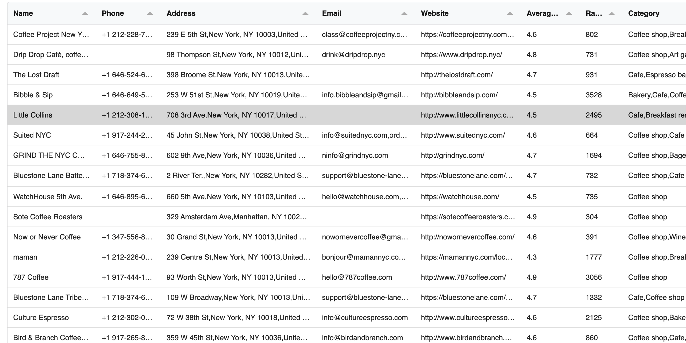

# **GMB Scraper — Google My Business (GBP) Data Extraction Tool**

**GMB Scraper** is a Chrome extension that extracts structured, high-quality business data directly from **Google My Business (Google Business Profile, GBP)** pages.
It helps marketers, sales teams, SEO agencies, automation builders, and SaaS developers gather verified B2B leads without manual copy-paste work.

This repository contains the compiled build of the extension for transparency and version tracking.

---

## 🚀 **What GMB Scraper Does**

GMB Scraper collects publicly available business information from Google Business Profile pages, including:

- Business name
- Address
- Phone number
- Website
- Emails (auto-detected from the business website or profile)
- Categories & subcategories
- Opening hours
- Rating & reviews count
- Social media links
- place_id, cid, kg_id
- Coordinates (lat/lng)

All data can be exported as **CSV or XLSX** with one click.

---

## 🎯 **Who Is This Tool For?**

GMB Scraper is designed for:

- **Lead generation agencies**
- **Marketers & growth teams**
- **SaaS founders building data pipelines**
- **SEO agencies and local business consultants**
- **Freelancers doing outreach or research**
- **Automation creators (Zapier/Make/n8n)**

If your work involves **Google Business Profiles**, this tool saves hours of manual extraction time.

---

## 📥 **How to Install**

The installation instructions are available on the official website.

👉 **Install the extension following the step-by-step guide:**

### 🔗 [How to install GMB Scraper extension](https://www.gmbscraper.org/install)

The guide includes:

- How to download the latest version
- How to load the unpacked extension in Chrome
- How to activate permissions
- How to start scraping business profiles

---

## 🧩 **How It Works**

1. Search for a business or keyword on Google My Business
2. Open the business’s Google Business Profile (GMB/GBP) page
3. The extension automatically detects and extracts data
4. Export all structured results into CSV/XLSX
5. Use the data in outreach tools, CRMs, or automation workflows

---

## 📸 **Screenshots**

### **Extracted Data Preview**

---

## 🛡️ **Legal Notice**

- GMB Scraper extracts **publicly available** business information only.
- It does **not** circumvent access controls, login systems, or paid APIs.
- Users are responsible for complying with local laws and platform terms.

---

## 🌐 **Official Website**

For tutorials, product updates, FAQs, and support:

👉 **[GMB Scraper](https://www.gmbscraper.org/)**

For installation instructions:

👉 **[How to Install GMB Scraper](https://www.gmbscraper.org/install)**

For local B2B lead generation:

👉 **[B2B Leads](https://link.zhihu.com/?target=https%3A%2F%2Fwww.gmbscraper.org%2F)**
